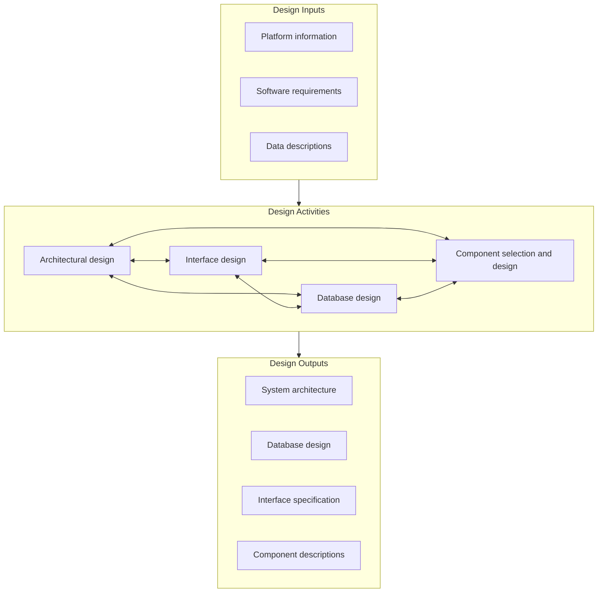
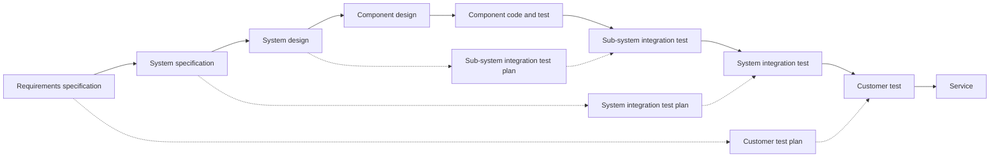
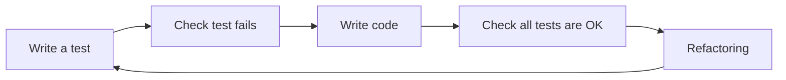
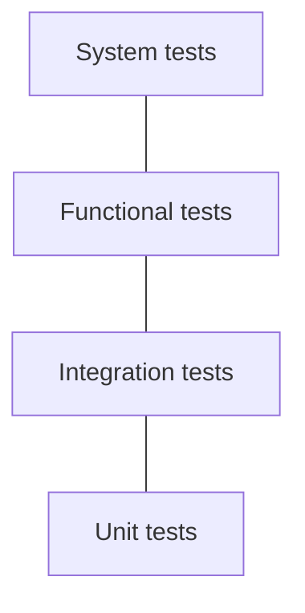
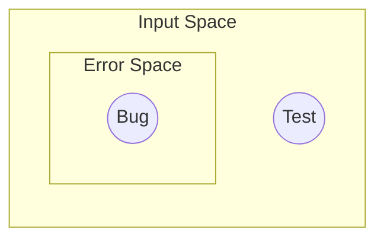
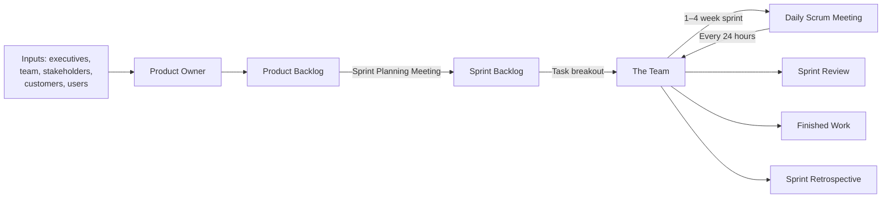
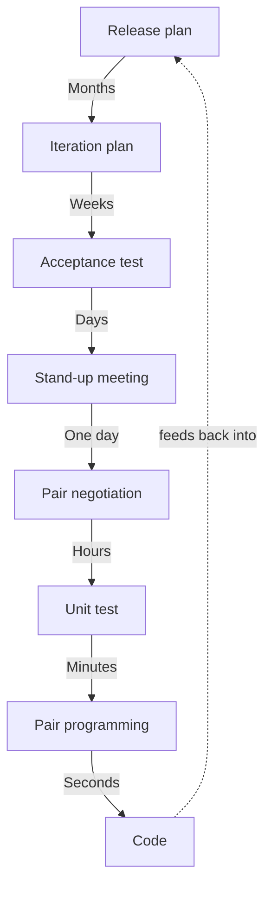
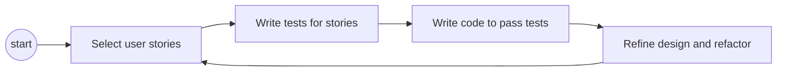
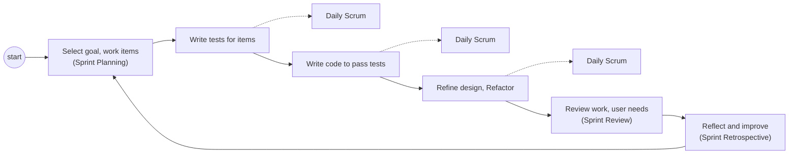
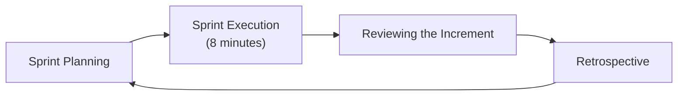

## What "Agile" Actually Means
The lecture covers the principles, core concepts, practices, and activities behind agile development. It's worth addressing directly why this matters: the term "agile" is very often misused as an excuse to skip proper engineering discipline, essentially as a pretext for hacking software together without structure. Agile isn't the absence of process, it's a specific, deliberate approach to managing software development, and it comes with its own discipline.

### The Agile Manifesto
The foundational document for the movement is the _Manifesto for Agile Software Development_, written by Kent Beck and 16 other software practitioners in 2001. It states:

> "We are uncovering better ways of developing software by doing it and helping others do it. Through this work we have come to value:
> 
> - Individuals and interactions over processes and tools
> - Working software over comprehensive documentation
> - Customer collaboration over contract negotiation
> - Responding to change over following a plan
> 
> while there is value in the items on the right, we value the items on the left more."

The last line matters as much as the four value pairs themselves. The manifesto doesn't say processes, documentation, contracts, and plans are worthless, only that when they conflict with the item on the left, the item on the left should generally win. This approach is very effective in practice, but it requires real discipline from the team; without that discipline, "we value individuals over process" quietly turns into "we have no process," which is exactly the misuse mentioned above.

In short, agile development focuses on two things above all else:

1. Always having working software, right from the start, supported by practices like continuous integration and constant testing.
2. Developing new features driven by the customer's actual needs and priorities, using practices like user stories and planning games (both covered later in this note).

### Setting Priorities: Features, Time, and Quality
Marc Andreessen, the venture capitalist, made an observation about how priorities should shift as a product matures. For an early product, a 1.0 or 2.0 release, he argued you should straightforwardly prioritize features over time, and time over quality: get something usable out fast, even if it's rough. But by the time a product reaches a 3.0 or 4.0 release, at some point a team has to stop and reset, flipping the order entirely to quality over time over features.

This isn't just a philosophical point, it directly shapes development decisions. For a mature product, prioritizing quality over time can mean deliberately slowing down to write cleaner code and investing more heavily in testing, even if that means shipping fewer new features per release.

### A Counter-Example: When Agile Practices Are Misapplied
Agile principles can be followed in letter while being violated in spirit. A concrete example: a global software team has offices in Silicon Valley and Bangalore, roughly 12 and a half hours apart. The team coordinates through daily standups scheduled at the start of the day for the US-based employees. On paper, this looks like a standard Scrum practice. In practice, it forces the Indian half of the team to stay up overnight, every single day, to attend a meeting scheduled entirely around the other office's convenience.

This is a misalignment between the _practice_ (daily standups) and the _principle_ it's meant to serve (individuals and interactions, sustainable teamwork). The mechanism is technically agile, but it isn't actually people-first. This example comes from research into the "dark side" of global agile development (Bjørn, Søderberg & Krishna, 2019), which documents how agile practices designed for co-located teams can create real harm when applied uncritically to distributed, cross-timezone teams.

---

## Core Tasks in Software Engineering
Regardless of the specific methodology used, software engineering work generally breaks down into five recurring tasks:

**Requirements specification** What is the actual problem? Who are the customer, the users, and the other stakeholders, and what do each of them need? Which properties should the system prioritize (speed, reliability, usability, and so on)?

**Analysis and design** What are the main software modules the system needs, and how do they interact with each other? Critically, can the design be changed easily as requirements evolve, since they almost always will?

**Implementation** How does the design actually get translated into working code?

**Testing** Does the code respect the specification? Does the resulting design actually solve the users' real requirements, not just the ones written down?

**Maintenance** How can the design be updated to accommodate new requirements that show up after the system is already in use?

### Requirements Engineering
Requirements engineering is the process of defining, documenting, and maintaining requirements throughout the design process. The classic cartoon illustrating why this is hard: a customer asks for "a scoring system for a whacky-flob game. Keep track of the foo-whacks, but not the flob-whacks, unless Boo is circulating." The joke lands because it's not actually that different from how real requirements often sound to an engineer hearing them for the first time: full of domain-specific terms and implicit rules the customer assumes are obvious.

This points to two separate questions a requirements engineer always needs to answer:

1. **Is the domain knowledge clear?** This usually requires direct investigation: ethnographic analysis, interviews with the actual users, or shadowing people as they do their real work.
2. **Is my interpretation of the problem clear, both to the customer and to my own team?** This requires writing down user and system requirements explicitly, and validating them with the people who'll actually use the system.

### Elements of Design
Once requirements are reasonably clear, design work splits into four closely interacting activities: architectural design (the high-level structure of the system), interface design (how components and users interact with the system), database design (how data is structured and stored), and component selection and design (choosing or building the individual pieces).

These four activities feed into each other constantly rather than happening in strict sequence. It's also worth noting how coursework tends to split this up: a course like this one (SPDP) focuses on architectural design, database design, and component selection and design, while a separate course (62550) focuses specifically on interface design. In practice, of course, a real team owns all four together.

### Validation and Verification
Getting code to compile is not the bar. The real questions are whether the code was written according to the actual requirements, and whether new code silently breaks dependencies that other components rely on.

Traditional software engineering addresses this with a layered process often called the V-model, where each design stage on the way down is mirrored by a corresponding testing stage on the way back up:

Each test plan is written alongside its matching design stage, not bolted on afterward, so that by the time a component is actually built, it's already clear exactly how it'll be validated.

At a smaller, day-to-day scale, teams practicing test-driven development follow a tighter loop: write a test, watch it fail (since the corresponding code doesn't exist yet), write the code needed to pass it, confirm the whole test suite still passes, then refactor the code to clean it up before repeating.

### Testing Strategies
Tests exist at different levels, roughly forming a pyramid where the cost of writing and running a test increases sharply as you move up:

- **Unit tests** invoke a single component (a "unit") and check whether its output matches the desired output. These are cheap to write and run, and should make up the bulk of a test suite.
- **Integration tests** check a unit without full control over every party involved in the test, for example when the test also touches a real database, uses threads, hits the network, or depends on timing.
- **Functional tests** treat the system as a black box, checking partial functionality by comparing the system's observable output against the functional specification, without looking at internal implementation details.
- **Acceptance tests** check whether the system actually fulfills the business and contractual requirements it was built for. These are typically run together with domain specialists or the customer directly, since they're the only ones who can really confirm the requirement is met.

**A worked example: a room allocator**

Consider building a system that only allows bookings for courses on a room that's actually available. Test-driven development means writing the tests for this behavior before writing the implementation. For example: a test confirming a freshly created room starts with zero allocations, a test confirming two non-conflicting bookings both succeed, a test confirming two bookings for the exact same time slot conflict (only one should succeed), and a test confirming a room's allocation can be freed again. Only after these tests exist does the actual `Room` class get implemented, with an `allocateDate` method that checks the requested time slot against everything already booked, and rejects it if there's a conflict.

Writing the tests first has a specific benefit beyond just "testing early": it forces you to pin down the exact expected behavior of the system, including edge cases like conflicting bookings, before you've written a single line of implementation that could bias your thinking.

### Prototyping
A prototype is an early, often incomplete version of a system, built to demonstrate the "to-be" system, elicit requirements from stakeholders, and get them actively involved in the design process. A good example is the early WHO COVID-19 information app: a handful of simple screens (how it spreads, how to wash your hands, how to avoid close contact) were enough to demonstrate the intended flow and gather feedback long before the final app was built.

### The Limits of Testing
It's worth asking directly: is test-driven development enough to certify the absence of bugs in a critical system? The honest answer is no.

Think of a system's full input space as a large area, with a smaller region inside it representing the error space, the set of inputs that would trigger a bug. Any specific test only checks a tiny point (or a handful of points) within that space. Passing all your tests only tells you that the points you happened to check behave correctly, it says nothing at all about the untested points, some of which may still fall inside the error space.

This is the core difference between **simulation-based verification** (running the system, or a model of it, against a finite set of specific data points and checking each one) and **formal verification** (mathematically proving that a property holds across the entire space of possible inputs, not just the ones you thought to test). A testing approach never guarantees a fail-free implementation, it only guarantees that the software passes the specific tests you provided. If a system needs a genuinely higher level of assurance, testing alone isn't sufficient, and formal methods become necessary.

---

## SCRUM
Scrum is the most widely used concrete framework for putting agile principles into practice. At a glance, the cycle looks like this:

Work items, features, stories, and other requirements come in from executives, the team, stakeholders, customers, and users. The Product Owner turns this into a ranked Product Backlog. At the start of each sprint, the team selects as much of the top of the backlog as it can realistically commit to delivering by the sprint's end, forming the Sprint Backlog. During the sprint (typically one to four weeks), the team meets daily to coordinate, tracked with tools like burndown or burnup charts, and the sprint concludes with a review of the finished work and a retrospective on how the process itself went.

Scrum's dominance isn't just theoretical. According to the 2021 State of Agile Survey, 81% of agile projects use Scrum or a Scrum-based hybrid: 66% use Scrum on its own, and 15% combine it with something else (9% with Kanban, 6% with XP specifically).

### Roles
**Product Owner (PO)** The Product Owner represents the voice of the customer. They manage the product backlog of work items and requirements, and they set the goal for what the team should accomplish during each sprint. The Product Owner is always a single individual, never a team; in other contexts this role is often called a product manager instead.

**Development Team** Developers have the flexibility to choose exactly how they implement each work item, the "how" is left to them. Review events, like the sprint review, are what hold them accountable for delivering what was actually needed. Each sprint, the team delivers a potentially shippable product "increment," and critically, nobody outside the team second-guesses their own effort estimates for their work items; estimation is the team's own responsibility.

**Scrum Master** The Scrum Master acts as a coach, in the specific sense of a servant-leader rather than a manager. They organize and moderate every Scrum event, and respectfully keep those events on track and on time. During Daily Scrums specifically, the Scrum Master takes on the additional responsibility of removing external impediments blocking the team's progress. Like the Product Owner, the Scrum Master is always an individual, not a team.

### Artifacts
**Product Backlog** An ordered list of every work item that might be needed for the product, ranked by priority.

**Sprint Backlog** The subset of backlog items selected to meet the Sprint Goal that was set during sprint planning.

**Product Increment** The sum of all product backlog items that were actually completed during a given sprint, representing a usable step forward in the product.

---

## Extreme Programming (XP)
Extreme Programming gets its name from taking a set of common-sense engineering practices and pushing them to their logical extreme. Its stated aim is an always-deployable system, to which features chosen by the customer are added and automatically tested on a fixed "heartbeat," where the heartbeat is simply the length of an iteration.

XP frames this as a set of nested feedback loops operating at very different timescales, from a release plan spanning months down to the act of writing code itself, which happens on the scale of seconds:

The idea is that feedback should be happening constantly, at every one of these timescales simultaneously, not just at the end of a release.

### XP Activities
XP organizes its practices around four core activities:

**Listening** Understanding what users actually want, captured through user stories written from the user's own perspective. A common format for this is the Connextra template:

> As a `<role>` I want to `<action>` so that `<benefit>`

The `<benefit>` clause is easy to skip but shouldn't be, it's what lets the team discern how urgently to prioritize the requirement relative to everything else on the backlog. For example: "As a customer I want to withdraw cash from an ATM so I can get cash when the bank is closed."

**Testing** Testing is treated as central to development, not an afterthought. XP distinguishes three specific kinds: acceptance testing for user stories, unit tests for individual pieces of code, and regression tests to confirm a change hasn't broken previously working code. Testing after every single change increases confidence in the code, and it directly helps debugging, since a newly failing test means either the new change itself has a bug, or it broke something that used to work. Perhaps counterintuitively, this discipline can actually shorten overall development time, since it catches problems immediately rather than letting them compound.

_Acceptance tests for user stories_ follow their own template, used to define what "done" actually means for a given story:

> Given `<context>` when `<triggered event>` then `<outcome>`

A single user story may need more than one acceptance test to fully cover its behavior. Ideally, each of `<context>`, `<triggered event>`, and `<outcome>` maps directly onto something concrete in the code, so the test can actually be automated rather than staying a vague description.

**Coding** Write simple, readable code. XP treats code as something that should be immediately understandable by any team member, not just its original author, which is part of why pair programming and constant review are central practices.

**Design** Refactoring: making semantic-preserving changes that improve the quality of the code without changing its behavior. Concretely, this means restoring modularity so each module has one clear responsibility, pulling duplicated functionality into a single shared method or module, improving control flow so the code's behavior is easier to read and predict, making sure variable and method names actually reflect their purpose, and adding comments that explain the rationale behind a decision, or explicitly flag what should _not_ be changed and why.

### XP and TDD
User stories map directly onto requirements, which XP then drives through a test-first cycle: select a user story, write tests for it, write the code needed to pass those tests, then refine the design and refactor before selecting the next story.

### Combining XP and Scrum
XP and Scrum aren't competitors, they operate at different levels and combine naturally. Scrum provides the outer structure: sprints, roles, ceremonies like planning, review, and retrospective. XP fills in the inner engineering loop: how work actually gets built and verified day to day, through the select-write tests-write code-refactor cycle described above.

A combined Scrum + XP hybrid process might look like this:

Given that 6% of agile teams reported using exactly this Scrum plus XP hybrid in the 2021 survey cited earlier, this isn't just a theoretical combination, it's a real and moderately common way teams actually work.

### To Summarize
Agile is best understood as an umbrella covering many specific methodologies, all of which adhere to the four core principles in the Agile Manifesto. Scrum and XP both actually predate the term "agile" itself, both originating in the 1990s, but they're fully consistent with the agile mindset once it was named in 2001. Critically, their practices aren't mutually exclusive: user stories, test-driven development, and layered validation can all be combined together to give much stronger guarantees around building genuinely maintainable products, rather than treating any one methodology as a complete, standalone solution.

---

## Practical Exercise: Lego4Scrum
The second half of this session is a hands-on simulation of a full Scrum process, using LEGO bricks as the implementation medium instead of code. This is a well-known teaching exercise designed to let a team experience a compressed version of the sprint planning, execution, review, and retrospective cycle within a single class period.

### Setup
**Objective** The class is given a single shared product goal: extend commuting facilities between Sweden and Denmark to serve the transportation needs of a joint "critical mass" of commuters between the two countries, using Copenhagen and Malmö as the concrete setting.

**Logistics** The class is split into teams, each corresponding to a project group, and each team selects its own Scrum Master from within the group. All teams are jointly responsible for the final product delivered, and each team decides for itself how to decompose the overall task. The exercise runs three sprints, with nine minutes allotted per sprint.

**The Product Owner's vision** The instructor, acting as Product Owner, presents a specific vision narrative for the session (the concrete brief for that particular class), and teams are encouraged to ask clarifying questions before starting, exactly as they would with a real Product Owner.

### Discovery and Backlog Creation
**Mapping user needs and journeys** (max 10 minutes) Each team identifies three potential users of the system and imagines a day in their lives: what do they need to do, what are their goals, and what constraints (location, timing) do they face? This mirrors the ethnographic, needs-finding side of requirements engineering discussed earlier, compressed into a few minutes.

**Ideating backlog items** Using LEGO as the team's "implementation API," each team brainstorms the concrete feature ideas needed to fulfill the user needs just identified, working on one user need at a time. Ideas go one per sticky note, and teams are explicitly encouraged not to be too conservative, unusual or ambitious ideas are welcome at this stage.

**Release planning** Teams then group their brainstormed features into three separate releases: a Minimal Viable Product (MVP), a Higher Quality of Service release, and a Scaling-up release. This mirrors real release planning, where not every desired feature belongs in the very first shippable version.

**Backlog refinement** For the items placed in the MVP specifically, teams add implementation details and rough estimates, using a relative T-shirt sizing scale (S, M, L, XL, XXL, XXXL) rather than precise time estimates. Several concrete constraints are given to make the estimation meaningful: all buildings must be proportional to each other, buildings in Malmö should share a consistent architectural style distinct from Copenhagen's, buildings can be between one and three floors, every building needs at least one door and one window per floor, building only the façade is acceptable as long as the structure is sound, and secondary features like coastlines or trees can be drawn on paper instead of built in LEGO. Two members of each team are specifically tasked with helping drive the prioritization discussion.

This refinement step uses a lightweight form of **planning poker**: each team works through its backlog independently, pulls items one at a time, adds any missing detail, recasts estimates when team members disagree, discusses the discrepancy until it converges, and then returns the refined, reprioritized item to the backlog.

**Reprioritizing** Before moving into execution, backlogs are reordered one more time with two rules in mind: landscape-specific items (the things that define the physical setting, like the coastline or the bridge) go first, since they'll frame everything built afterward, and simpler elements are scheduled earlier so the team can learn the mechanics of the exercise before tackling more complex items in later iterations.

### Running the Sprints
Each of the three sprints follows the same structure:

**Sprint planning** Each team pulls items from the shared backlog into their own sprint backlog for that iteration. Once an item is claimed by a team, other teams are expected to leave it alone rather than duplicate the work.

**Sprint execution (8 minutes)** Each team tracks its own work using a simple To Do, In Progress, Done board, moving physical build tasks across the three columns as the sprint progresses. The tight eight-minute window is intentional, it forces the same kind of prioritization and scope discipline a real sprint requires, just compressed dramatically.

**Reviewing the increment** The whole class does acceptance testing together at the end of each sprint, checking the built increment against the backlog items it was meant to satisfy, exactly as a Sprint Review would in a real Scrum process.

**Retrospective** Each team runs its own short internal retrospective (5 minutes), followed by a combined retrospective across the whole class. The exercise then loops straight back into the next sprint's planning, carrying forward whatever was learned.

### Closing: Lessons Learned
The exercise ends with a group discussion of lessons learned. Since this varies by class and depends on what actually happened during the sprints, the specific takeaways are meant to be generated live by the group rather than presented in advance, but they typically circle back to the same core theme from the start of the lecture: agile practices only work when the underlying principles, people-first collaboration, tight feedback loops, and genuine responsiveness to change, are actually respected, not just performed.