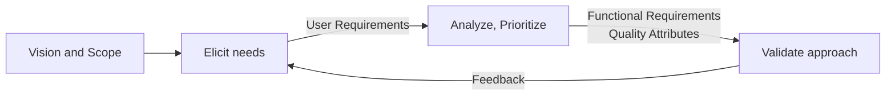
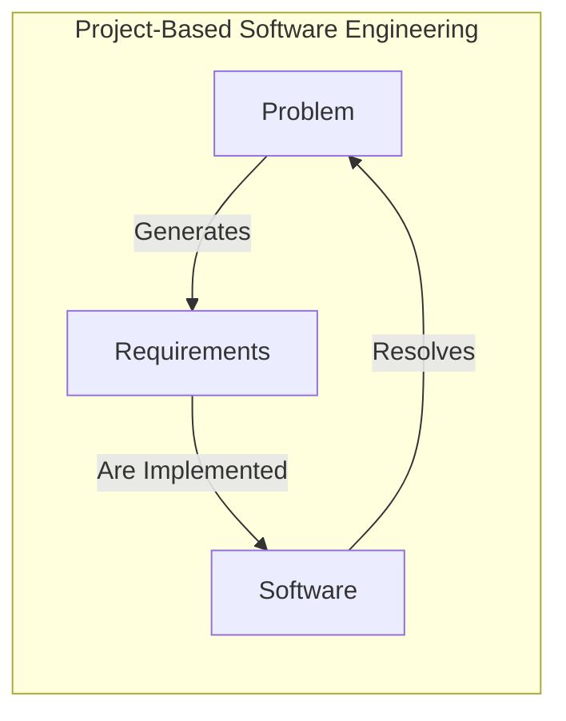
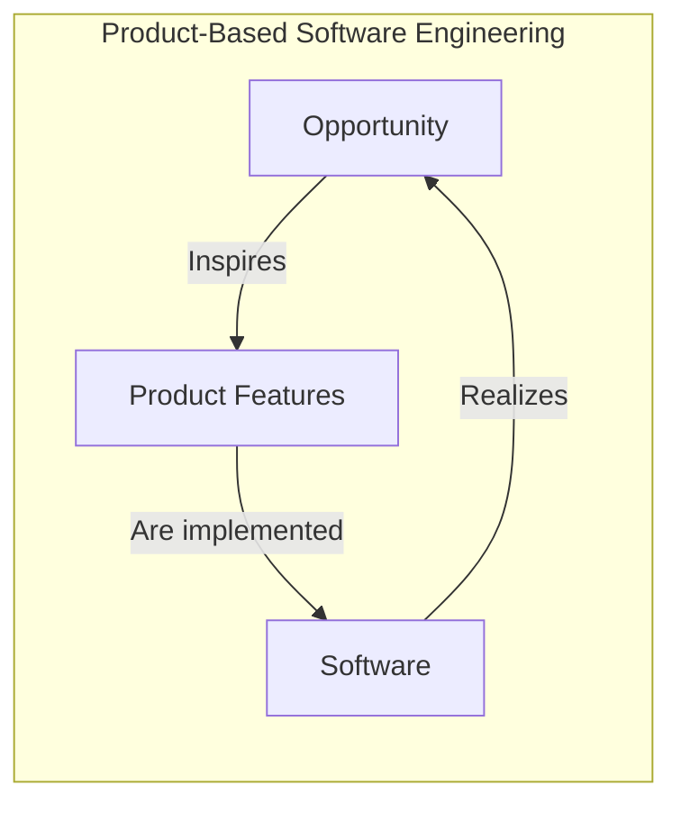
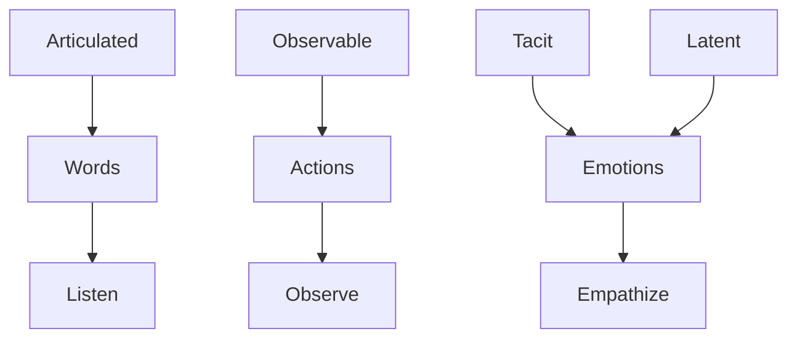
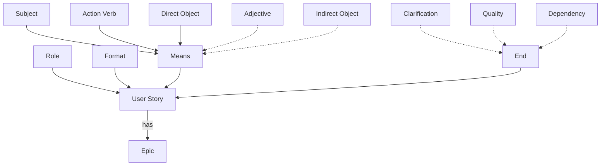

## What Is a Requirement?

Informally, an IEEE-style requirement bundles together four kinds of information: the **goal** (a business or stakeholder objective or need), the **functionality** (what the product must, or must not, do to help meet that goal), the **quality attributes** (properties like scale, reliability, or security), and any **constraints** (limits on the product itself, or on the process used to build it).

A realistic requirement usually weaves all four together in a single piece of text. For example: a password-reset requirement might state that the system shall let users securely recover account access without administrative help, by emailing a reset link that expires after 30 minutes (functionality and constraint), that the whole process shall complete within 5 seconds under normal load and the link shall carry at least 128 bits of entropy against brute-force guessing (quality attributes), that the email shall render correctly in major clients like Gmail, Outlook, and Apple Mail (constraint), and that the implementation shall comply with GDPR and avoid logging plaintext email content (constraint), all running over the company's existing SMTP infrastructure (constraint). Notice how naturally a goal (self-service account recovery) pulls in functional detail, quality attributes, and constraints all at once, this mixing is completely normal in practice.

## What Is a Specification?

A specification is geared towards implementation. Where a requirement can stay somewhat abstract, a specification is complete, precise, and verifiable, describing a product or some aspect of it in enough detail to actually build against. A **Software Requirements Specification (SRS)** is the detailed specification document for an entire project. In practice, requirements gradually blur into specifications as they become more detailed, precise, and unambiguous, there's rarely a sharp line between the two.

Continuing the password-reset example: a specification version says exactly how, not just what. It states that the backend shall generate a 128-bit random token using SHA-256, store it in a `password_reset_tokens` table alongside the user ID, a timestamp, and a used flag, embed it into a URL of the form `https://example.com/reset-password/{token}`, and enforce expiration by checking both that the token's timestamp is within 30 minutes and that the used flag is false before allowing the reset to proceed. This is implementation-ready in a way the requirement above wasn't.

## The Basic Requirements Engineering Lifecycle

Requirements engineering runs as a loop, not a one-off step. Starting from an initial vision and scope, the team elicits needs from stakeholders, producing user requirements. These get analyzed and prioritized, producing functional requirements and quality attributes. The result gets validated against the original approach, and feedback flows back into eliciting needs again, closing the loop.

## Detour: Software Project or Software Product?

It's worth pausing on a distinction that shapes everything downstream: is the work a _project_ or a _product_?

**Software products** are generic systems providing functionality useful to a whole group of users, ranging from large-scale business systems (Microsoft Teams) to personal products (Evernote) to simple apps or games (Wordle). The development team itself owns the product's inception, marketing, evolution, and eventual retirement.

**Custom software systems**, by contrast, are tailored to one specific target group, usually the contractor who commissioned the project. Once delivered, it's the customer, not the development team, who decides (and pays for) whatever evolution or closure comes next.

The two follow structurally different cycles. In project-based engineering, a **problem** generates requirements, which get implemented as software, which resolves the problem. In product-based engineering, an **opportunity** inspires product features, which get implemented as software, which in turn realizes the opportunity.

## What Do Users Need?

User needs sit at different depths, and each depth demands a different way of surfacing it. **Articulated** needs are the ones users can put into words directly, so the way to access them is to listen. **Observable** needs show up as a mismatch between what people say and what they actually do, so the way to access them is to observe. **Tacit** and **latent** needs are the hardest: tacit is the "I can't find the words, but I'll know it when I see it" case, and latent is a need or feature the user didn't even know they had, until it's shown to them. Both are accessed primarily through empathy, reading the emotions and context around a need rather than a direct statement of it.

There are real communication gaps hiding in this picture: a gap between a need and how it happens to be exhibited by the user, and a further gap between what a user "sends" and what a developer actually "gets" from that signal. Both gaps grow wider the deeper the need sits.

**A worked example: the lunar greenhouse.** A lunar greenhouse is used to study growing vegetables in space; it needs to stay warm enough for plants to grow, but not so warm that water is lost to evaporation. The user's _articulated_ need was a phone app that notifies them if the temperature drifts out of range, since most trips to physically check the greenhouse turned out to be unnecessary, the temperature was almost always fine.

Once that articulated need was met, a further pattern emerged: the user only got on their bike when a notification fired, to inspect and decide whether manual adjustment was needed, but usually no adjustment was needed at all, since the automatic controls already handled it. This revealed a _latent_ need the user never explicitly asked for: remote inspection via video, letting the user check on the greenhouse from their phone at any time, without needing a notification as the trigger at all.

## Product Vision

Before diving into individual requirements, a product needs a **vision**: a simple statement defining its nature. A good vision answers three questions: what is the product being developed, who are the target customers and users, and why should customers pay for it?

**Geoffrey Moore's vision template** gives a standard structure for this:

> For [final client], whose [problem that needs to be solved], the [name of the product] is a [product category] that [key benefits, reason to buy it]. Different from [competition alternative], our product [key difference].

Applied to a real example: "FOR residents in Denmark WHO need to consult and report the risk of COVID infection, THE Smittestop app is a smartphone-based application THAT provides case reporting, proximity alerts, and statistical information regarding COVID that inform customers of critical healthcare alerts. UNLIKE other apps available, OUR product provides a personalizable customer experience, allowing users to merge their healthcare data with their activity trackers."

**Where does vision inspiration come from?** Four common sources. **Domain experience**: frustration with existing tools that don't support real work activities can ripple into opportunities for a better system. **Product experience**: finding a simpler or better way to deliver similar functionality can lead directly to a new tool. **Customer experience**: a long-running conversation between developer and potential customer naturally converges on an understanding of what an improved product should look like. **Prototyping**: sometimes requirements simply can't be understood well enough without building an experimental tool to probe them, an approach illustrated by tools like DCR-JS, a browser-based prototype built to explore declarative process modeling.

## Requirements Management in Software Projects

Sommerville's classic model frames requirements engineering as a spiral with three key activities, each answering a different question. **Elicitation and analysis** asks what the customer actually wants. **Specification** asks whether the requirements are clear enough yet. **Validation** asks whether these really are the requirements the customer wants, closing the loop back to elicitation if not. The spiral moves outward from an initial feasibility study, through business, user, and system requirements elicitation, to a full system requirements document, with reviews and prototyping supporting the process at every turn.

### Feasibility Studies

A feasibility study's main purpose is establishing an initial, shared vision for a project's objectives: is this actually worth spending time, money, and resources on? This typically sits within the elaboration phase of a project and needs to answer, concretely, how much it will cost and when it can be delivered.

A feasibility study typically covers: the **purpose** (for example, "the goal of this project is to automate over-the-counter medicine delivery operations"), the **target audience** (e.g., "citizens and non-acute patients & pharmacists"), the **justification** (e.g., reducing on-site pharmacist delivery costs, increasing reliability, supporting home-care initiatives), the **organizational impact** (will departments change, will there be layoffs?), and the **process impact** (will stakeholders' way of achieving business goals actually change?). Beyond that, it should weigh **solutions** (what alternatives could meet the business goal), the **solution's impact** (e.g., "the solution will require upskilling the pharmacy department"), a **cost-benefit analysis** (development cost, maintenance cost, hardware/software, personnel), and end with a clear **recommendation**: should the project actually move into a further phase?

## What Is a Requirement, Revisited

Requirements are the capabilities and conditions to which the system, and more broadly the project, must conform. Practically, this means capturing what users need in a form that lets the team find out what it's actually about, communicate it clearly to others, and remember it later, three simple tests that a huge amount of requirements documentation quietly fails.

### Requirement Types

Requirements exist at three levels, each aimed at a different audience. **Business requirements** describe the business goals the system supports, focused on the processes needed to achieve those goals and how they relate to each other; software is only an enabler here, the organizational and human aspects matter just as much. **User requirements** target stakeholders directly (people with domain knowledge, but not necessarily system knowledge), describing the goals intended users expect the software to satisfy, and forming the base for the system's design and analysis. **System requirements** target the development team (people with system-development experience, but not necessarily domain knowledge), describing concretely how user requirements will actually be met.

### Users and Roles

Any successful project needs to explicitly identify its stakeholders: the customers who pay for the product or project, the users who will actually operate it, and everyone else who will be affected by it without necessarily using it directly, patients, operators, government bodies, competitors, or managers, depending on the domain.

## Eliciting Needs

### Interviews

A good elicitation interview helps users understand their own needs more clearly, often by asking questions the user hasn't thought to ask themselves: in what way does this functionality help achieve a business goal, and why are we doing this at all? Where does the process start, and what can the user do from there? Are there alternatives? What can go wrong? When does the process end, and how often does it happen? Who actually does this work? And, perhaps most usefully, how else could the same objective be achieved?

### Process Mining

Where interviews rely on what people say, process mining works from what systems actually record: analyzing event logs from existing IT systems to reconstruct the real processes people follow in practice, often revealing gaps between the official process and what actually happens day to day. This technique has seen particular use in healthcare settings, where systems generate rich, timestamped event logs almost as a byproduct of routine care.

## Personas

A persona paints the picture of an archetypal user of the system: short, easy to read, and grounded in a specific background and motivation for using the system. It describes educational background and technical skill level, since these directly determine whether the software will actually be useful, understandable, and usable by the real people behind the archetype.

A well-built persona template typically balances four kinds of content: **relevance** (details of the persona's interest in the product specifically), **job-related information** (their role and working context), **educational information** (their background and skill level), and overall **personalization** (a name, a quote, a face, something that makes the archetype feel like a real person rather than a checklist). A worked example: "Shanti, Doctor Coordinator from Maldives," a persona built for a healthcare coordination product, gives her demographics (age, marital status, work location, team size across time zones), psychological aspects (great at time management, frustrated by the overhead of coordinating meetings across time zones), motivators (values flexibility and remote work), and concrete pain points (difficulty coordinating meetings and staying in touch with a distributed team). Every one of these details earns its place because it directly shapes what the product needs to do for her.

## Scenarios in Product Development

A scenario is a narrative describing how a user might use the system to achieve an objective, typically a short story, well under a page, about a situation where a user applies the product's features to accomplish something they actually want. Scenarios work best when they explicitly reference personas, so developers understand not just what's happening but the capabilities and motivations of the person it's happening to. For example: "Carrie, a second year internal medicine intern at Mount Pleasant Hospital, walks into the room of his patient, Andrew Ross. Since Andrew stayed the night in the hospital, Carrie needs to review Andrew's medical records to see if the nurses on the night shift had checked in and recorded any changes in Andrew's condition." Scenarios like this stay at a high level, they describe _what_ happens in sequence, without prescribing _how_ the interaction is actually implemented.

## User Stories

User stories are fine-grained narratives that set out, in a more detailed and structured way than a scenario, a single thing a user wants from a software system. Where scenarios describe a sequence of interaction end to end, a user story isolates one specific piece of value.

User stories serve as the basic requirements documentation for agile processes. They're literally framed as a story the user tells about the system, for example, "here is the story of when I used the system last time to book a simple flight from Copenhagen to Paris and back," capturing value for the customer or stakeholder. In practice, they're written with a tighter focus on features: "As a customer, I want to book and plan a single flight from Copenhagen to Paris." And critically, a user story can carry both functional and non-functional requirements at once, for example, "the search for a flight from Copenhagen to Paris shall take less than 5 seconds" belongs just as naturally in a user story as the feature itself does.

**A worked exercise: Rejsekort.** Rejsekort is the Danish national travel card system. Thinking through real trips taken with it surfaces a rich, non-exhaustive set of user stories: as a customer, I want to check in with my travel card so that I can start a travel; as a customer, I want to check out with my travel card so that I can end a travel; as a customer, I want to be able to transfer from one mode of transportation to another so that I can continue my travel; as a customer, I want to be able to continue my travel after check-out so that it only counts as one travel; as a customer, I want to be checked-out automatically after a certain time limit so that my travel is ended; as a customer, I want to be able to get my travel history so that I can keep track of my travels; and as a controller, I want to be able to check whether a customer has checked in so that he does not have to pay a fine. A second cluster covers reloading balance: as a customer, I want to be able to reload my travel card so that I have enough balance; as a customer with a reload agreement, I want my travel card to be automatically reloaded so that I always have enough balance; as a customer, I want to be able to order a reload agreement so that my travel card gets automatically reloaded; and correspondingly, stories for activating and cancelling that reload agreement. Notice how each story isolates exactly one need, with its own reason, rather than trying to describe the whole check-in/check-out journey in one go.

### Anatomy of a User Story

The standard template is: **As a** [role] **I want to** [goal] **so I can** [reason]. For example: "As a registered epidemiologist, I want to access updated and detailed information regarding the number of COVID cases in a given zip code, so I can report changes in the existing guidelines to the government." The "so I can" clause isn't decoration, it's what lets the team judge why this story is actually useful, which in turn can influence how it should function and suggest other useful features nearby.

Good user stories share a few characteristics: they're intended for Product Owners to define functional tests against, they give a development team a sense of scope without dictating implementation (specific enough to know what to test, general enough to leave room for how), they're short and independent of other stories, and they deliver clear value to the Product Owner. It's also worth being clear on how user stories differ from use cases: a use case tends to describe a complete, structured interaction between an actor and a system, often across multiple paths and exceptions, while a user story deliberately stays smaller and lighter, a single slice of value meant to be negotiated and refined through conversation rather than fully specified up front.

### The 3 C's

Ron Jeffries's "3 C's" capture what a user story actually is, and isn't, in three parts. **Card**: user stories are written on cards, physical or virtual, and the card is only a token representing the requirement, not a full description of it, just enough to remind everyone what the story is about. **Conversation**: the real requirement gets communicated from customer to programmer through ongoing conversation over time, not through the text on the card alone. **Confirmation**: acceptance tests, ideally automated, confirm that the story has actually been implemented correctly.

This connects directly to how stories get managed day to day. The guiding mantra is to use the simplest tool possible, traditionally literal index cards and post-its. Stories are collected into a **product backlog**, a prioritized list of requirements, often tracked digitally in a tool like Trello once a team outgrows physical cards.

### Requirements Activities in Agile Development

Agile development doesn't treat requirements as a one-time upfront phase. Working software gets validated continuously, and requirements get revisited iteratively as that validation surfaces new information, closing essentially the same feedback loop introduced at the very start of this note, just running continuously across many short cycles instead of once.

### Prioritizing with MoSCoW

One common approach to prioritizing user stories is the MoSCoW method. **Must have** items form the minimal usable subset needed for a Minimum Viable Product. **Should have** items are important but not time-critical, not relevant for the current delivery timeframe. **Could have** items are desirable features that can improve usability if there's room for them. **Won't have** (or "would like") items are explicitly excluded from the current delivery timeframe, not rejected forever, just deliberately deferred.

### User Story Maps

A user story map adds a further dimension on top of a flat backlog, grouping stories by the higher-level goals they serve. Rather than a single prioritized list, stories get arranged across a horizontal backbone of user activities, with related stories stacked vertically beneath each one, making it much easier to see both the big picture of a user's journey and which specific stories belong to which part of it, and to slice out a coherent, end-to-end release rather than just the top N items of a flat list.

## The INVEST Characteristics of Good User Stories

Bill Wake's 2003 INVEST mnemonic gives six characteristics a good user story should have. **Independent**: dependencies between stories should be avoided wherever possible. **Negotiable**: the fine details of a story get discussed during iteration planning meetings, not locked in advance. **Valuable**: a story without discernible value to the customer shouldn't be implemented at all. **Estimable**: there's enough detail in the story to actually estimate the effort it requires. **Small**: stories represent small chunks of work, roughly three to four days' effort. **Testable**: every story needs to be testable in order to be considered done.

## Behaviour-Driven Development

Behaviour-Driven Development (BDD) promotes writing acceptance criteria that complement a story's who, what, and why, determining precisely when a story counts as fulfilled. The standard structure is **Given** some context, **When** some action is carried out, **Then** a set of observable consequences occur, with **And** available to chain together multiple conditions within any of the three parts. This gives a user story a testable, unambiguous definition of done, directly satisfying the "testable" leg of INVEST above.

## Understanding User Stories from Linguistics

It helps to formalize what a user story is actually made of, structurally. A user story combines a **role**, a **means** (what the user wants to do), an **end** (why they want to do it), and a **format** (the template itself), and a related set of stories can be grouped under a broader **epic**.

Breaking down the _means_ using this model: take "I want to receive reminders of forgotten checkouts." Under the conceptual model, this decomposes into a role (`I`), an action (`receive`), an adjective (`new`), and a direct object (`notification about missing checkout`), essentially the grammatical subject, verb, and object of the sentence.

The _end_ can play one of several roles: a clarification of the means, a quality aspect, or a dependency on another user story. Take "so that I write a good literature review": this decomposes into a role (`I`), a quality (`good`), and what's effectively a dependency or clarification (`literature review`), showing that the "so that" clause isn't just flavor text, it's carrying real structured information about why the story matters.

## Quality Problems in Practice

Even when a story technically fits the INVEST criteria and the linguistic template above, real-world stories still go wrong in predictable ways: they're too long, they include unnecessary information, they include too little information, they're inconsistent with other stories, they're irrelevant, or they're simply ambiguous. This is exactly the gap the Quality User Story framework, covered next, was built to close.

## The Quality User Story (QUS) Framework

The QUS framework grew out of a critical analysis of hundreds of real user stories, incorporating insights from other frameworks like INVEST, and splits its criteria into two levels: quality of an individual story, and quality of a set of stories taken together.

**Quality of an individual user story:**

|Criterion|Description|
|---|---|
|Well-formed|Includes at least a role and a means|
|Atomic|Expresses a requirement for exactly one feature|
|Minimal|Contains nothing more than role, means, and end|
|Conceptually sound|The means expresses a feature and the end a rationale|
|Problem-oriented|Only specifies the problem, not the solution to it|
|Unambiguous|Avoids terms that lead to multiple interpretations|
|Full sentence|Is a well-formed, complete sentence|
|Estimable|Doesn't denote an unrefined requirement that's hard to plan or prioritize|

**Quality of a set of user stories:**

|Criterion|Description|
|---|---|
|Conflict-free|No two or more inconsistent user stories exist in the set|
|Unique|Duplicate stories are avoided|
|Uniform|Every story in the specification follows the same template|
|Independent|A story is self-contained, with no inherent dependency on other stories|
|Complete|Implementing the whole set produces a feature-complete application; nothing is missing|

### QUS in Practice

Working through each criterion with a real violation and correction makes the framework much more concrete.

**Well-formed** requires at least a role and an action. Violation: "I want to revoke access for problematic event organizers" (no role stated). Correction: "As a TicketExpert Employee, I want to revoke access for problematic event organizers."

**Atomic** requires exactly one story per feature or problem. Violation: "As a Visitor, I want to register for an event and create a personal account, so that I can quickly register for future events" (two features bundled together). Correction: split into "As a Visitor, I want to register for an event, so that I am admitted to the event" and "As a Visitor, I want to create a personal account during event registration, so that I can quickly register for future events."

**Minimality** allows only one role, one action, and one benefit, nothing else. Violation: "As an Event Organizer, I want to see the personal information of attendees (split into price levels). See: Mockup by Alice NOTE: - First create the overview screen" (implementation notes and references smuggled into the story). Correction: "As an Event Organizer, I want to see the personal information of attendees," with everything else stripped out.

**Conceptually sound** requires the action to express a feature and the benefit to express a genuine rationale, not another feature in disguise. Violation: "As an Event Organizer, I want to open the event page, so that I can see the list of participants" (the "so that" clause is actually a second feature, not a reason). Correction: split into "As an Event Organizer, I want to open the event page, so that I can review event related information" and "As a User, I want to see the list of participants, so that I know the demographical distribution of the event."

**Problem-oriented** means the story specifies the problem, never the solution. Violation: "As a Visitor, I want to download an event ticket. - Add download button on top right (never grayed out)" (a specific UI solution baked directly into the story). Correction: "As a Visitor, I want to download an event ticket so I can have access locally in case of bad internet," leaving the actual button design to the design and implementation phase.

The remaining criteria are harder to enforce with automated tooling, but are equally important. **Ambiguity** means avoiding terms with multiple interpretations. Violation: "As an Event Organizer, I want to edit the content that I added to an event's page" (what exactly is "content"?). Correction: "As an Event Organizer, I want to edit video and text content that I added to an event's page."

**Conflict-freedom** means no story contradicts another. Violation: one story says "As an Event Organizer, I'm able to edit any event" while another says "As an Event Organizer, I'm able to delete only the events that I added," an inconsistent scope of authority between editing and deleting. Correction: tighten the first story to match the second, "As an Event Organizer, I'm able to edit events that I added."

**Estimable** stories avoid denoting a requirement too unrefined to plan around. Violation: "As an Event Organizer, I want to see my task list during the event, so that I can prepare myself (e.g., I can see when I should leave home)" (bundles two different roles and an unclear scope). Correction: split into "As an Event Employee, I want to see my task list during the event, so that I can prepare myself" and "As an Event Organizer, I want to upload a task list for event employees."

**Independence** means a story is self-contained, with no inherent dependency on others. Violation: "As an Event Organizer, I am able to add a new event" alongside "As a Visitor, I am able to view an event page," where the second implicitly depends on the first having happened. Here there's genuinely no clean fix, it's not always possible for stories to be fully independent. The practical approach is to avoid dependencies as much as possible while staying flexible, and to group closely related stories together under a shared epic (for instance, everything related to "event page") rather than pretending the dependency doesn't exist.

**Completeness** means implementing the whole set produces a feature-complete application. Violation: a set containing only "As an Event Organizer, I want to update an event" and "As an Event Organizer, I want to delete an event," with no way to create one in the first place. Correction: add the missing story, "As an Event Organizer, I want to create an event," completing the basic lifecycle.

## To Sum Up

User stories are a key element for understanding and negotiating requirements, built around a simple who, what, and why. They belong to an agile mindset, deliberately staying informal rather than becoming a formal specification. But informal doesn't mean unconstrained: to actually be useful, they still need to observe real criteria, captured across the frameworks covered in this lecture: INVEST for the story itself, BDD for turning a story into a testable definition of done, and the AQUSA/QUS framework for catching the quality problems that show up again and again in practice.